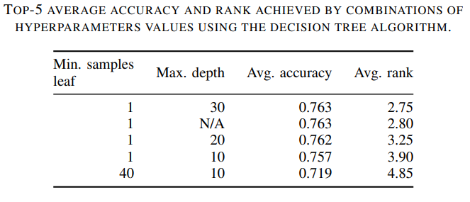
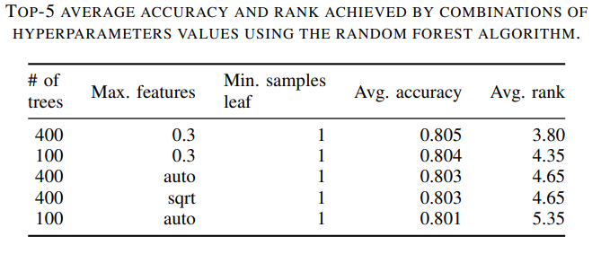
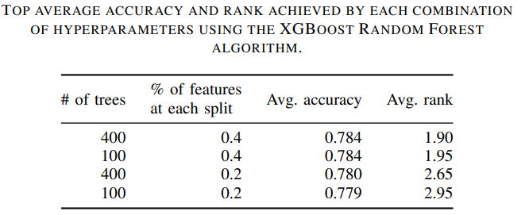

## Data preprocessing

After defining the fine-tuned classification algorithm, we explore whether data pre-processing techniques can improve the prediction accuracy. To verify if discretization of continuous variables in the dataset can improve the classification accuracy, we evaluate three discretization functions: $log_{2}$, $log_{10}$, and _MDLP_ (Minimum Description Length Principle) [1].

The $log_{2}$ and $log_{10}$ discretization functions are straightforward, as they replace each continuous value $x$ in the dataset with its $log_{2}(x)$ or $log_{10}(x)$ values rounded to their nearest integer value. This is especially useful when the specific values are less relevant than the order of magnitude. For instance, knowing that some _merge durations_ take minutes while others take weeks may be more relevant than knowing the exact number of minutes each merge takes. As an example, consider an attribute value of $10.6$. Since ${log_{2}(10.6) = 3.406}$, the $log_{2}$ discretization for this attribute value would be $3$. In comparison, ${log_{10}(10.6) = 1.025}$. Thus, discretizing this attribute value with the $log_{10}(x)$ function would result in the value $1$. Differently from these, the _MDLP_ discretization function is based on the minimization of the entropy of the data to create multiple intervals.

The data cleaning phase of our work includes the treatment of missing values, as the collected data may contain missing attribute values due to tool error, invalid repository states, or other problems. As Decision Tree and Random Forest cannot handle missing data, we adopted the strategy to replace missing values with a placeholder value to investigate if it can further improve the classification accuracy.

The results and details of the discretization and data cleaning of the dataset can be found in this [jupyter notebook](https://github.com/gems-uff/conflict-resolution-mining/blob/main/scripts/classifier/discretization_impact_classification.ipynb). Overall, none of the experimented preprocessing techniques resulted in accuracy improvement.

Finally, our last pre processing task is feature selection. We evaluate three feature selection techniques: tree-based feature selection, recursive feature elimination, and IGAR (Information Gain Attribute Ranking) [2]. The goal of using such techniques is to investigate if the accuracy of MESTRE improves by selecting subsets of the available attributes. To achieve this, we evaluate MESTRE with the training set to measure the average accuracy for each feature selection approach. 

The tree-based feature selection technique uses importance weights to select attributes. In our case, it uses the Gini index, which is calculated during the training of the Random Forest. Attributes with a Gini index smaller than the mean Gini index of the provided data are discarded. In comparison, the recursive feature elimination method also uses the Gini index to rank the importance of the attributes. However, in this method, rounds of cross-validation are performed using subsets of the attributes. At each round, the weakest attribute is eliminated. The final subset of selected attributes is based on the highest accuracy obtained during this procedure. 

IGAR is a feature selection method that ranks attributes by their information gain [3], which is a measure that calculates the reduction of the classes entropy obtained from the splitting of the dataset by the values of an attribute. It indicates how well the target classes can be separated using an attribute. An attribute with a higher value of information gain can provide a better separation of classes on the partitions produced from the dataset.
Unlike the two other feature selection methods, the IGAR method has an input value $n$ that specifies how many attributes will be selected. This method returns the $n$ attributes with the highest information gain values based on this value. 

To select the $n$ value to be used for IGAR in our context, we perform a fine-tuning experiment. The first step is to find the minimum number $m$ of attributes among all projects in the training set. Then, for each project in the training set, we apply the IGAR method for each $n$ from 1 to $m$ using 10-fold cross-validation. The output of this process is a set containing the average accuracy for each tested $n$ value for each project. Using this output, we select the $n$ value which, among all projects, reached top-1 accuracy most of the time. The results of the IGAR tuning for our context is available in this [jupyter notebook](https://github.com/gems-uff/conflict-resolution-mining/blob/main/scripts/classifier/IGAR_tuning.ipynb).

After fine-tuning the IGAR method, we evaluate MESTRE to investigate if any of the three feature selection methods improves the average accuracy. The results are available in this [jupyter notebook](https://github.com/gems-uff/conflict-resolution-mining/blob/main/scripts/classifier/feature_selection.ipynb). None of the preprocessing tasks were able to increase the average accuracy obtained by MESTRE.

## Hyperparameters combinations

In this section, we display the accuracy results of the best combinations found while searching for hyperparameters to be used by each classification algorithm in our study.

The above figure shows the top-5 average rank of combinations of hyperparameters values for the Decision Tree algorithm. We chose the best-ranked combination to be used in our comparison of classification algorithms. The details of the parameter search for this algorithm can be found in this [jupyter notebook](https://github.com/gems-uff/conflict-resolution-mining/blob/main/scripts/classifier/decision_tree_tuning.ipynb).

The above figure shows the top-5 combinations of the Random Forest input hyperparameters, ordered by the average rank. There seems to be not much variation in the average accuracy achieved by the top-5 combinations of hyperparameters for the Random Forest algorithm. Nonetheless, we chose the top-ranked combination to be used in our study. The details of the parameter search for this algorithm can be found in this [jupyter notebook](https://github.com/gems-uff/conflict-resolution-mining/blob/main/scripts/classifier/random_forest_tuning.ipynb).

The above figure shows the overall average accuracy and rank for each combination of the selected hyperparameter values. The best-performing combination for this algorithm has the _n\_estimators_ hyperparameter value of 400 and the _colsample\_bynode_ hyperparameter set to 0.4, which represents 40\% of the features. We used this combination in the next phase of the study (algorithms comparison). The details of the parameter search for this algorithm can be found in this [jupyter notebook](https://github.com/gems-uff/conflict-resolution-mining/blob/main/scripts/classifier/xg_boost_randomforest_tuning.ipynb).

## References

[1] Fayyad, U., & Irani, K. (1993). Multi-interval discretization of continuous-valued attributes for classification learning.

[2] Witten, I. H., Frank, E., Hall, M. A., Pal, C. J., & DATA, M. (2005, June). Practical machine learning tools and techniques. In Data Mining (Vol. 2, No. 4).

[3] Quinlan, J. R. (1986). Induction of decision trees. Machine learning, 1(1), 81-106.